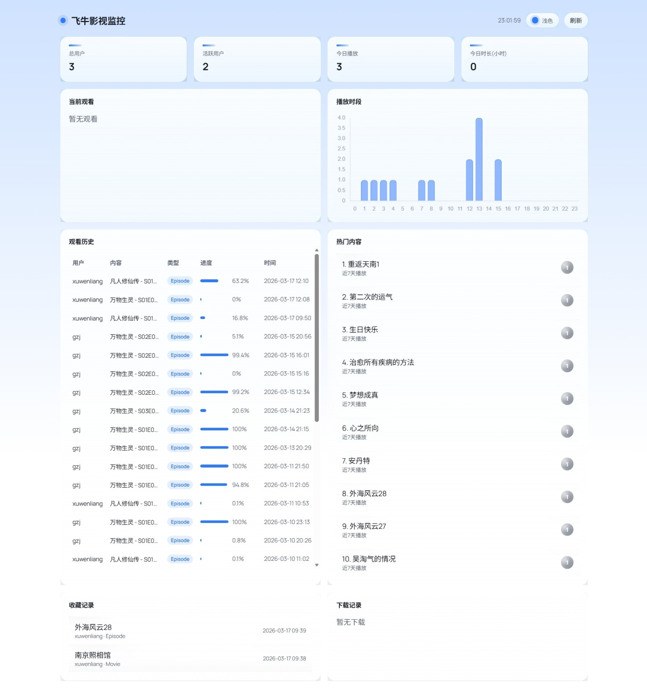
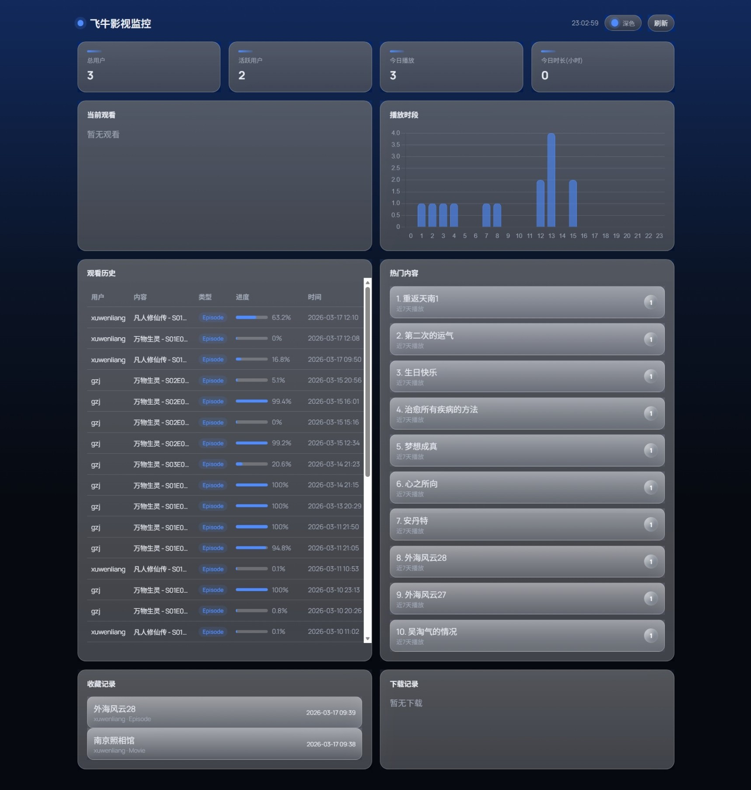

# 飞牛影视监控服务




一个轻量级的飞牛影视观看监控面板，支持实时观看状态、历史记录、访问日志分析。

## 功能特性

- 📊 统计数据：总用户、活跃用户、今日播放、观看时长
- 👀 实时监控：当前观看用户、播放进度
- 📈 图表展示：7天播放时段分布、内容类型分布
- 🔍 访问日志：IP归属地、运营商、设备信息
- 🗺️ 地图展示：观看位置可视化
- 📜 历史记录：完整播放历史、支持用户筛选

## 部署到飞牛NAS

### 1. 准备数据库

飞牛影视数据库位置（trim.media）：
```
/usr/local/apps/@appdata/trim.media/database/trimmedia.db
```

### 2. 上传项目

将整个 `fnmedia-monitor` 文件夹上传到NAS，例如放在 `/mnt/user0/fnmedia-monitor/`

### 3. 挂载数据库目录（只读）

使用宿主机数据库目录直接挂载到容器内（只读）：

```
/usr/local/apps/@appdata/trim.media/database:/app/database:ro
```

### 4. 启动服务

```bash
cd /mnt/user0/fnmedia-monitor
docker-compose up -d
```

### 5. 配置Lucky反向代理

在Lucky中添加反向代理：
- 本地地址：`172.17.0.1:5000`（NAS docker网络IP）或 `127.0.0.1:5000`
- 绑定域名：`你的域名`

## 可选：配置日志（获取访问者IP）

1. 打开Lucky → Web服务 → 访问日志
2. 设置日志保存路径为 `/mnt/user0/fnmedia-monitor/logs`
3. 日志格式使用 Nginx 标准格式

## 环境变量

| 变量 | 默认值 | 说明 |
|------|--------|------|
| FNMEDIA_DB_PATH | /app/database/fnmedia.db | 数据库路径 |
| LOG_PATH | /app/logs | 日志目录 |
| LOG_ENABLED | 0 | 是否启用访问日志（Lucky/VPS） |
| PORT | 5000 | 端口 |
| IPINFO_TOKEN | - | ipinfo.io Token（可选，用于更精准的IP查询） |

## 访问

部署完成后，通过Lucky绑定的域名访问监控面板。

## 项目结构

```
fnmedia-monitor/
├── main.py              # Flask后端
├── config.py            # 配置文件
├── docker-compose.yml   # 容器配置
├── requirements.txt     # 依赖
├── README.md            # 部署说明
├── templates/
│   └── index.html       # 前端页面
└── database/
    └── fnmedia.db       # 飞牛影视数据库（需手动复制）
```
