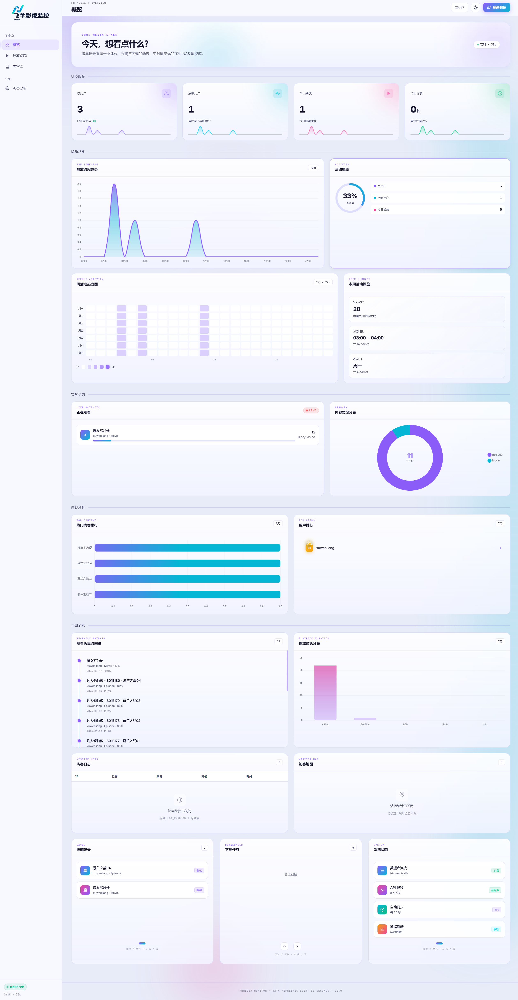
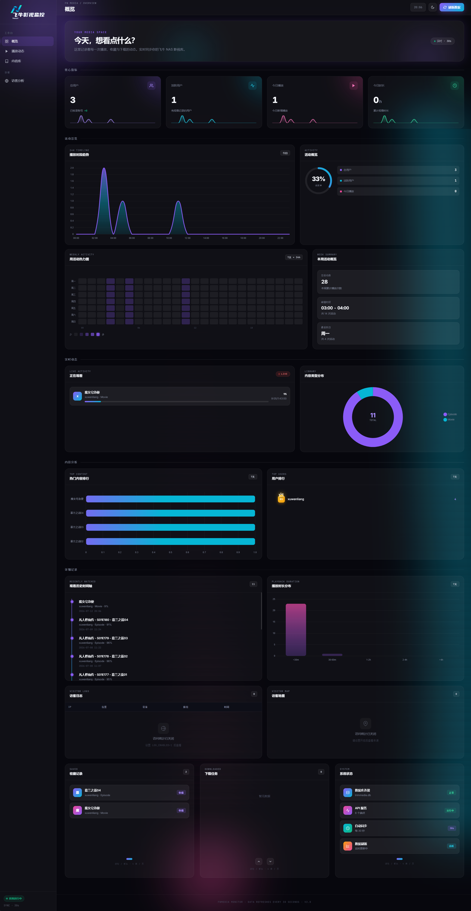

# 飞牛影视监控服务




一个轻量级的飞牛影视观看监控面板，支持实时观看状态、历史记录、访问日志分析。

## 功能特性

- 📊 统计数据：总用户、活跃用户、今日播放、观看时长
- 👀 实时监控：当前观看用户、播放进度
- 📈 图表展示：7天播放时段分布、内容类型分布
- 🔍 访问日志：IP归属地、运营商、设备信息
- 🗺️ 地图展示：观看位置可视化
- 📜 历史记录：完整播放历史、支持用户筛选

## 部署到飞牛NAS

### 1. 准备数据库

飞牛影视数据库位置（trim.media）：
```
/usr/local/apps/@appdata/trim.media/database/trimmedia.db
```

### 2. 上传项目

将整个 `fnmedia-monitor` 文件夹上传到NAS，例如放在 `/vol3/1000/docker/fnmedia-monitor/`

### 3. 启动服务

**方式一：使用 docker-compose（推荐）**

```bash
cd /vol3/1000/docker/fnmedia-monitor
sudo docker compose up -d
```

**方式二：使用 docker run**

```bash
sudo docker run -d \
  --name fnmedia-monitor \
  --restart unless-stopped \
  -p 5000:5000 \
  -e FNMEDIA_DB_PATH=/app/database/trimmedia.db \
  -e LOG_PATH=/app/logs \
  -e LOG_ENABLED=1 \
  -e DB_COPY_TTL=60 \
  -e TZ=Asia/Shanghai \
  -v /usr/local/apps/@appdata/trim.media/database:/app/database:ro \
  -v /vol3/1000/docker/fnmedia-monitor/logs:/app/logs \
  --memory=200m \
  --cpus=0.5 \
  deepvoce/fnmedia-monitor:v2.0
```

### 4. 访问监控面板

部署完成后，通过 `http://你的NAS-IP:5000` 访问监控面板。

---

## ⚠️ 重要：启用访客日志和访客地图

> **访客日志**和**访客地图**功能需要反向代理产生的访问日志才能工作。
> 如果不配置反向代理，这两个模块将没有数据。

### 前置条件

1. 容器启动时必须设置环境变量 `LOG_ENABLED=1`
2. 必须挂载日志目录 `-v /path/to/logs:/app/logs`
3. 必须有一个反向代理（如 Lucky）将访问日志写入上述目录

### 方式一：使用 Lucky（推荐，fnOS 用户友好）

Lucky 是 fnOS 平台的反向代理工具，支持 WebUI 配置。

**安装 Lucky：**
1. 打开 fnOS → 应用中心 → 搜索 "Lucky" → 安装

**配置反向代理：**
1. 打开 Lucky → Web服务 → 反向代理
2. 添加新的反向代理规则：
   - **本地地址**：`127.0.0.1:5000`（或 `172.17.0.1:5000`，取决于 Docker 网络模式）
   - **绑定域名**：你的域名（如 `media.example.com`）

**配置访问日志（必须）：**
1. 打开 Lucky → Web服务 → 访问日志
2. 添加日志记录规则：
   - **日志路径**：`/vol3/1000/docker/fnmedia-monitor/logs`
   - **日志格式**：选择 **Nginx 标准格式**（combined 格式）
3. 确保日志文件名以 `.log` 结尾（如 `access.log`）

**验证配置：**
```bash
# 配置完成后，通过域名访问一次监控面板
# 然后检查日志文件是否生成
ls -la /vol3/1000/docker/fnmedia-monitor/logs/
# 应该能看到 access.log 文件且大小在增长
```

### 方式二：使用独立 Nginx 容器（高级用户）

如果你使用其他反向代理（如 Nginx、Caddy、Traefik），需要确保：

1. 反向代理将访问日志输出到容器挂载的 `/app/logs` 目录
2. 日志格式为 **Nginx combined 格式**：
   ```
   $remote_addr - $remote_user [$time_local] "$request" $status $body_bytes_sent "$http_referer" "$http_user_agent"
   ```
3. 日志文件名以 `.log` 结尾

**Nginx 配置示例：**
```nginx
# 在 http 块中添加
log_format combined '$remote_addr - $remote_user [$time_local] "$request" '
                    '$status $body_bytes_sent "$http_referer" '
                    '"$http_user_agent" "$http_x_forwarded_for"';

# 在 server 块中添加
access_log /vol3/1000/docker/fnmedia-monitor/logs/access.log combined;
```

---

## 环境变量

| 变量 | 默认值 | 说明 |
|------|--------|------|
| FNMEDIA_DB_PATH | /app/database/trimmedia.db | 飞牛影视数据库路径（必须） |
| LOG_PATH | /app/logs | 访问日志目录 |
| LOG_ENABLED | 0 | 是否启用访问日志功能（0/1） |
| DB_COPY_TTL | 60 | 数据库副本刷新间隔（秒） |
| CACHE_TTL | 30 | API 响应缓存时间（秒） |
| PORT | 5000 | Web 服务端口 |
| IPINFO_TOKEN | - | ipinfo.io Token（可选，用于更精准的IP查询） |

## 项目结构

```
fnmedia-monitor/
├── main.py              # Flask后端
├── config.py            # 配置文件
├── docker-compose.yml   # 容器配置
├── requirements.txt     # 依赖
├── README.md            # 部署说明
├── templates/
│   └── index.html       # 前端页面
├── logs/                # 访问日志目录（需反向代理写入）
│   └── access.log
└── database/
    └── fnmedia.db       # 飞牛影视数据库
```

## 常见问题

### Q: 访客日志和地图没有数据？

**A:** 这两个功能需要反向代理的访问日志。请确保：
1. `LOG_ENABLED=1` 已设置
2. 已配置 Lucky 或其他反向代理
3. 反向代理的日志路径指向容器挂载的 `logs/` 目录
4. 日志格式为 Nginx combined 格式

### Q: 数据没有同步？

**A:** 请检查：
1. 数据库文件路径是否正确
2. 容器是否正确挂载了数据库目录（只读模式）
3. 容器日志中是否有错误信息

### Q: 如何查看容器日志？

```bash
docker logs fnmedia-monitor
```

## 相关链接

- **GitHub**: https://github.com/deepvoce/fnmedia-monitor
- **Docker Hub**: https://hub.docker.com/r/deepvoce/fnmedia-monitor
- **Lucky 下载**: fnOS 应用中心搜索 "Lucky"

## 许可证

MIT License — 自由使用、修改和分发
